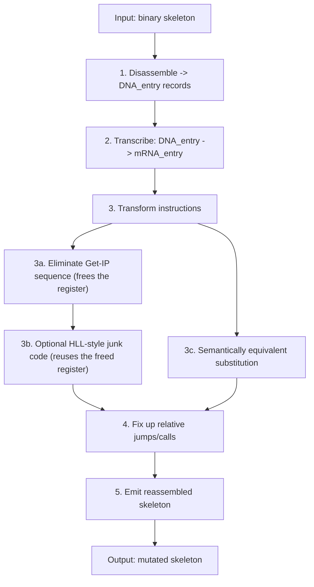

# RME

**Metamorphic/polymorphic recompiler for 16-bit x86 code (DOS). Designed in 2000–2001.**

> 6K+ lines of 16-bit x86 assembly (TASM), 35+ files, 5-stage pipeline: disasm → IR → mutate → reassemble → encrypt.\
> Rebuilt from a 2000–2001 archive, confirmed to assemble and run correctly.

## What it is

- An engine that disassembles x86 real-mode code and reassembles it into a functionally equivalent but differently-shaped binary — the core idea behind metamorphic malware and, later, commercial code obfuscators.
- Works at the x86 real-mode instruction level, on a curated instruction subset (see [Instruction coverage](#instruction-coverage)) — not a general-purpose x86 recompiler.

## Historical context

The disassemble-transform-reassemble idea behind RME is the same one behind modern commercial code protection and academic obfuscators — RME has no relation to these projects, but shares the underlying technique.

Around the same time, two other approaches to code transformation were documented in the virus research community:
- **Simile/MetaPHOR** (The Mental Driller, 2001–2002) — rewrites its own body: disassembles it into an intermediate form, transforms it, and reassembles it, reportedly able to both grow and shrink the result.\
RME follows a broadly similar disassemble → transform → reassemble shape, on a far narrower instruction set.
- **Zmist/Mistfall** (Z0mbie, 2000–2001) — a structurally different idea: rather than rewriting its own body, it disassembles the *host* program and interleaves itself into the host's existing code,  rebuilding all cross-references and relocations.

RME is an independent implementation, built around the same time as both, targeting 16-bit DOS COM files rather than 32-bit Windows PE —and, unlike either, contains no infection or replication logic of its own: it is a transformation core, not a self-propagating program.

**Comparison with open-source transformation/protection tools**

The table below lines up RME against later tools solving a related problem, for reference — not as peers. The gap is large and uneven: 6 years to ReWolf's x86 Virtualizer, 9 to O-LLVM, 13 to Tigress — RME predates virtualization-based obfuscation and anti-emulation techniques becoming standard tools of the trade, which the ❌ rows below reflect as a timing gap, not a design shortcoming.

| Criterion | RME | O-LLVM | Tigress | ReWolf x86 Virtualizer |
|---|---|---|---|---|
| **Target platform** | DOS (16-bit, COM) | any LLVM target | any (C source) | Windows (PE) |
| **Level of operation** | binary | IR | source | binary |
| **Instruction substitution** | ✅ | ✅ | ✅ | ❌ |
| **Virtualization (VM-based)** | ❌ | ❌ | optional | ✅ |
| **Metamorphism (output structurally differs per build)** | ✅ | ✅ | ✅ | ❌ |
| **Polymorphic decryptor / encryption** | ✅ | ❌ | ❌ | ❌ |
| **Anti-debug / anti-analysis features** | ❌ | ❌ | ✅ | ✅ |
| **First release** | 2000–2001 | 2010 | ~2013–2014¹ | 2007 |
| **Implementation language** | x86 Assembly | C++ | OCaml + C | C++ |
| **Source availability** | this repo | open | ⚠️ binaries public, source on request to academics | open |

¹ Earliest version found in the public changelog is 1.1 (May 2014); earlier versions aren't precisely dated in public sources.

Commercial code virtualizers (VMProtect, Themida) predate every open-source tool in this table by several years — VMProtect and Themida both emerged around 2005 — suggesting the underlying ideas were already circulating commercially around the time RME was written, though no direct link between them is known or claimed.

## How it works

Pipeline:

1. **Disassemble** — the binary skeleton (the program being protected) is parsed into instruction records (`DNA_entry`).
2. **Transcribe** — each `DNA_entry` becomes a working `mRNA_entry`, carrying mutation state (`@new_addr`, `@new_len`, `@old_indx`) alongside the original.
3. **Transform** each instruction, dispatched through a type → handler table rather than a monolithic branch:
   - detect and eliminate the classic Get-IP idiom (`call $+5; pop reg; sub reg, offset`) by recompiling `[reg+offset]` references into absolute `[offset]` addressing — one byte shorter per instruction, and the register is freed entirely: nothing in the mutated body still expects it to hold a position-independent base (see `ip_lea_reg16_mem_type` / `translate_ip_lea2mov` in `DISASM_PROCS.INC`),
   - which is what makes it safe to optionally interleave Borland C++ 3.1–style junk code using that same register as a genuine C-style stack frame pointer (`push bp; mov bp,sp ... pop bp`) — without this prior step, the junk prologue would collide with the engine's own addressing scheme,
   - replace other instructions with semantically equivalent variants.
4. **Fix up** relative jumps and calls (`CALL`, `JNZ`, `LOOP`, `JMP`) whose targets moved during mutation.
5. **Emit** the reassembled binary.

The dispatch-table design in step 3 is what makes the engine extensible: adding a new instruction class means adding a table entry and a handler, not touching the rest of the pipeline.

## Main options

Set in `RME.INC` / `RME2.INC` / `RME3.INC`:

- `use_gen_decryptor` — generate and mutate a decryptor that guards the skeleton (e.g. a license check) from static analysis.
- `mutate_protected_code` — mutate the body of the protected program itself, not just its decryptor.
- `use_debug` — enable DNA/mRNA dumps.
- `use_emul` — run the output through the built-in emulator as a correctness check. This was a prototype verification path that was never exercised in real use and is disabled by default; treat it as unproven rather than as a validated test harness.
- `use_borland_c_junk` — interleave Borland C++ 3.1–style junk code.

| Mode | Config file | `use_gen_decryptor` | `mutate_protected_code` |
|---|---|---|---|
| **Polymorphic** | `RME3.INC` | yes | no — only the decryptor is mutated |
| **Metamorphic** | `RME2.INC` | no | yes — skeleton's body mutated, nothing encrypted |
| **Full** | `RME.INC` | yes | yes — both |

## Instruction coverage

RME does not implement the full x86 instruction set. It covers a curated subset sufficient to demonstrate genuine mutation and Get-IP elimination: register moves, `XOR`/`INC`/`DEC`/`ADD`/`SUB` forms, and the two IP-relative patterns (`ip_ref_sub`, `ip_ref_add`) behind the Get-IP idiom. The authoritative list is the dispatch table in `DISASM/PROCS.INC` and`RNA2DNA/PROCS.INC` — treat this section as a pointer, not a spec.

## The DNA/mRNA metaphor

The naming in RME is not arbitrary — it mirrors the biological flow of genetic information and the process of metamorphic transformation.

```
DNA → (transcription) → mRNA → (translation) → protein
```

| Biology | RME | Role |
|---|---|---|
| **DNA** | `DNA_buffer` / `DNA_entry` | Stable representation of the original skeleton after disassembly |
| **Transcription** | `init_mRNA_entry` | Copies `DNA_entry` → `mRNA_entry`, adding mutation fields |
| **mRNA** | `mRNA_buffer` / `mRNA_entry` | Mutable working copy used for transformation |
| **Translation** | `rebuild_skeleton` | `mRNA` → new machine code in `temp_skeleton` |
| **Protein** | `temp_skeleton` | Functional output — the mutated skeleton |
| **Reverse transcription** | `rna2dna/` | Converts the working copy back into a stable "genome" |
| **Epigenetics** | `epigenetic_mutation` | Changes code *expression* without changing meaning |
| **Mutation** | `translate_*` handlers | Point substitutions of instructions |

`DNA_entry` describes an instruction abstractly (type, registers, target), not as raw bytes — the invariant "genome" of the code. `mRNA_entry` is a transcript that can be mutated without touching the original. The engine never mutates the source in place: it transcribes, mutates, translates, and only then commits the result.

## Pipeline diagram



## Architecture

- `core/` — core, initialization, register selection.
- `build/` — code generation (decryptor builder).
- `disasm/` — disassembler.
- `rna2dna/` — instruction translation.
- `rna2dna/borlandc/` — BC31 mimicry.
- `emul/` — emulator (prototype, never exercised in real use).
- `debug/` — debugging and dumps.

## Build and run

- Assembler: TASM, 16-bit, `.386`.
- Entry points: `RME.ASM`, `RME2.ASM`, `RME3.ASM` — test wrappers, one per mode.
- Assemble and run under DOS or DOSBox.
- Output: `rme_test.com`, `rmetest2.com`, `rmetest3.com`, plus `.dmp` debug dumps.
- Status: confirmed to assemble, run, and produce correct output for all three `RME*.ASM` examples under DOSBox 0.74-3, with TASM on `PATH` (`set PATH=C:\TASM\BIN;%PATH%`), `core=dynamic`, `cycles=max`. This reproduces the original 2000–2001 build; it has not been tested beyond the provided examples or under other DOSBox versions.

## Status

Version 1.07a (alpha). Later versions are lost; a search is ongoing.

## Project lineage

RME did not appear in isolation — it is the product of skills built across the other projects in this account, in a specific order:
- **[the Sweeper](https://github.com/andrei-ag/sweeper)** (2000) — an antivirus engine with its own instruction emulator, able to disinfect polymorphic viruses. Building it is what taught the  reverse-engineering and code-analysis skills everything after it relies on.
- **[MaximusSL](https://github.com/andrei-ag/MaximusSL)** (2001) — a scripting language interpreter for the Maximus BBS. Writing a parser and a small virtual machine gave direct, practical compiler-construction experience.
- **RME** (2000–2001, this repo) would not have been possible without either of the above: its disassemble → transform → reassemble pipeline is, in effect, compiler-construction technique applied to mutation, and that approach came directly out of building MaximusSL, on a reverse-engineering foundation laid by the Sweeper.
- **[xpl_av](https://github.com/andrei-ag/xpl_av)** (2004) — an antivirus with its own emulator, in turn, builds directly on RME: the disassembler & heuristic RME uses — generalizes into the pattern-recognition techniques xpl_av needed to emulate and disassemble the far more advanced polymorphic engines of its era, such as Win32/Driller (AKA TUAREG). Without RME, xpl_av's detection approach would not exist in its current form.

## Disclaimer

For educational and historical purposes only. Do not use for malicious purposes.

## Authors

© Copyleft 2000–2001. Andrei AG & MM.

## License

GPL-3.0
