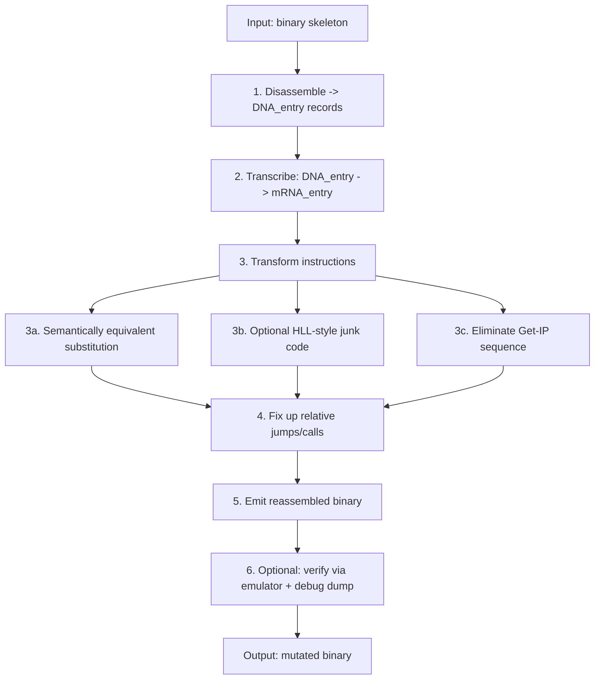

# RME

**Metamorphic recompiler for x86 DOS code. Designed in 2000–2001.**

> ~6,000 lines of TASM across 37 files, five pipeline stages. Revived from a 2000–2001 archive in 2026.

## What it is

- An engine that disassembles x86 real-mode code and reassembles it into a functionally equivalent but differently-shaped binary — the core idea behind metamorphic malware and, later, commercial code obfuscators.
- Works at the x86 real-mode instruction level, on a curated instruction subset (see [Instruction coverage](#instruction-coverage)) — not a general-purpose x86 recompiler.

## Historical context

The disassemble-transform-reassemble idea behind RME is the same one behind modern commercial code protection (VMProtect, Themida) and academic obfuscators (OLLVM, Tigress) — RME has no relation to these projects, but shares the underlying technique.

Around the same time, two other approaches to code transformation were documented in the virus research community:
- **Simile/MetaPHOR** (The Mental Driller, 2001–2002) — rewrites its own body: disassembles it into an intermediate form, transforms it, and reassembles it, reportedly able to both grow and shrink the result.\
  RME follows a broadly similar disassemble → transform → reassemble shape, on a far narrower instruction set.
- **Zmist/Mistfall** (Z0mbie, 2000–2001) — a structurally different idea: rather than rewriting its own body, it disassembles the *host* program and interleaves itself into the host's existing code,  rebuilding all cross-references and relocations.

RME is an independent implementation, built around the same time as both, targeting 16-bit DOS COM files rather than 32-bit Windows PE —and, unlike either, contains no infection or replication logic of its own: it is a transformation core, not a self-propagating program.

## How it works

Pipeline:

1. **Disassemble** — the binary skeleton is parsed into instruction records (`DNA_entry`).
2. **Transcribe** — each `DNA_entry` becomes a working `mRNA_entry`, carrying mutation state (`@new_addr`, `@new_len`, `@old_indx`) alongside the original.
3. **Transform** each instruction, dispatched through a type → handler table rather than a monolithic branch:
   - replace it with a semantically equivalent variant,
   - optionally interleave Borland C++ 3.1–style junk code,
   - detect and eliminate the classic Get-IP idiom
     (`call $+5; pop reg; sub reg, offset`) by recompiling `[reg+offset]` references into absolute `[offset]` addressing — one byte shorter per instruction.
4. **Fix up** relative jumps and calls (`CALL`, `JNZ`, `LOOP`, `JMP`) whose targets moved during mutation.
5. **Emit** the reassembled binary.
6. **Verify** (optional) — run the result through the built-in emulator and compare against a `DNA`/`mRNA` debug dump.

The dispatch-table design in step 3 is what makes the engine extensible: adding a new instruction class means adding a table entry and a handler, not touching the rest of the pipeline.

## Modes

| Mode | Config file | `use_gen_decryptor` | `mutate_protected_code` |
|---|---|---|---|
| **Polymorphic** | `RME3.INC` | yes | no — only the decryptor is mutated |
| **Metamorphic** | `RME2.INC` | no | yes — body mutated, nothing encrypted |
| **Full** | `RME.INC` | yes | yes — both |

- `use_gen_decryptor` — generate and mutate a decryptor.
- `mutate_protected_code` — mutate the body itself.
- `use_debug` — enable DNA/mRNA dumps.
- `use_emul` — verify output via the built-in emulator (prototype).
- `use_borland_c_junk` — interleave Borland C++ 3.1–style junk code.

## Instruction coverage

RME does not implement the full x86 instruction set. It covers a curated subset sufficient to demonstrate genuine mutation and Get-IP elimination: register moves, `XOR`/`INC`/`DEC`/`ADD`/`SUB` forms, and the two IP-relative patterns (`ip_ref_sub`, `ip_ref_add`) behind the Get-IP idiom. The authoritative list is the dispatch table in `DISASM/PROCS.INC` and`RNA2DNA/PROCS.INC` — treat this section as a pointer, not a spec.

## The DNA/mRNA metaphor

The naming in RME is not arbitrary — it mirrors the biological flow of genetic information and the process of metamorphic transformation.

```
DNA → (transcription) → mRNA → (translation) → protein
```

| Biology | RME | Role |
|---|---|---|
| **DNA** | `DNA_buffer` / `DNA_entry` | Stable representation of the original skeleton after disassembly |
| **Transcription** | `init_mRNA_entry` | Copies `DNA_entry` → `mRNA_entry`, adding mutation fields |
| **mRNA** | `mRNA_buffer` / `mRNA_entry` | Mutable working copy used for transformation |
| **Translation** | `rebuild_skeleton` | `mRNA` → new machine code in `temp_skeleton` |
| **Protein** | `temp_skeleton` | Functional output — the mutated skeleton |
| **Reverse transcription** | `rna2dna/` | Converts the working copy back into a stable "genome" |
| **Epigenetics** | `epigenetic_mutation` | Changes code *expression* without changing meaning |
| **Mutation** | `translate_*` handlers | Point substitutions of instructions |

`DNA_entry` describes an instruction abstractly (type, registers, target), not as raw bytes — the invariant "genome" of the code. `mRNA_entry` is a transcript that can be mutated without touching the original. The engine never mutates the source in place: it transcribes, mutates, translates, and only then commits the result.

## Pipeline diagram



## Architecture

- `core/` — core, initialization, register selection.
- `build/` — code generation (decryptor builder).
- `disasm/` — disassembler.
- `rna2dna/` — instruction translation.
- `rna2dna/borlandc/` — BC31 mimicry.
- `emul/` — emulator.
- `debug/` — debugging and dumps.

## Build and run

- Assembler: TASM, 16-bit, `.386`.
- Entry points: `RME.ASM`, `RME2.ASM`, `RME3.ASM` — test wrappers, one per mode.
- Assemble and run under DOS or DOSBox.
- Output: `rme_test.com`, `rmetest2.com`, `rmetest3.com`, plus `.dmp` debug dumps.

## Status

Version 1.07a (alpha). Later versions are lost; a search is ongoing.

## Related projects

Same account, different eras and stacks:

- [xpl_av](https://github.com/andrei-ag/xpl_av) — antivirus engine with a disassembler + emulator (2004), built on the same table-driven design philosophy.
- [MaximusSL](https://github.com/andrei-ag/MaximusSL) — scripting language interpreter for the Maximus BBS (2001).

## Disclaimer

For educational and historical purposes only. Do not use for maliciouspurposes.

## Authors

© Copyleft 2000–2001. Andrei AG & MM.

## License

GPL-3.0
